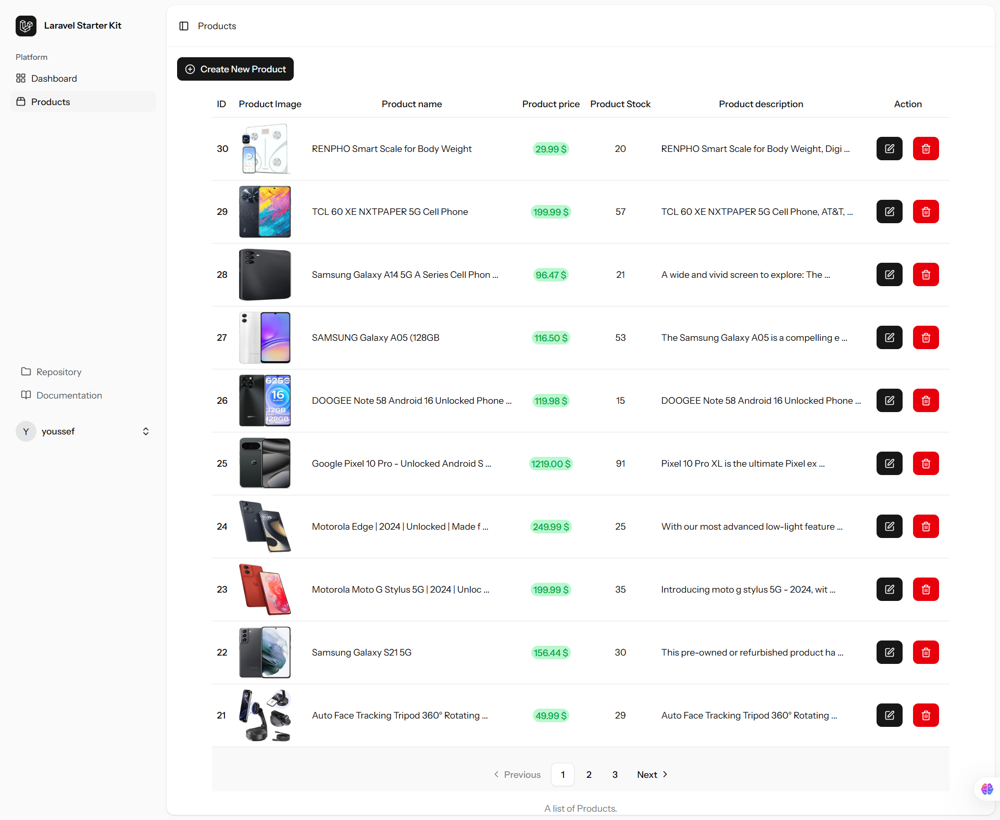
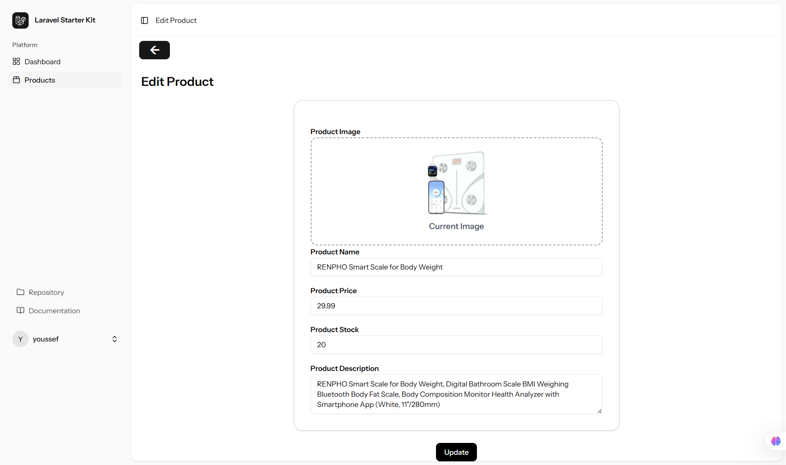
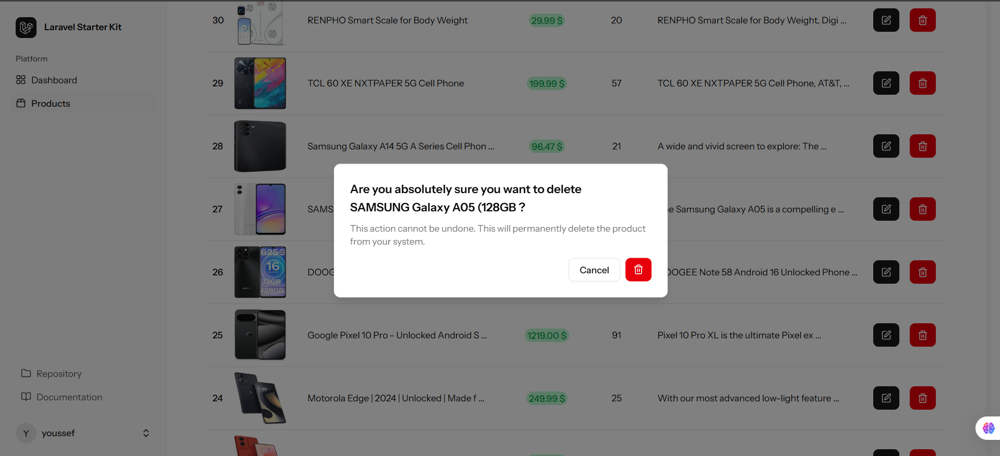

# 🛍️ Product Management App

A modern and elegant **Product Management System** built with **Laravel 12**, **Inertia.js**, **React**, **TypeScript**, and **Shadcn UI**.  
This app allows you to manage your products efficiently — add, edit, delete, upload images, and control stock — all in one clean and interactive dashboard.

- The products informations are scraped from amazon with the help of Apify platform and his amazon product scraped Actor

---

## 🚀 Tech Stack

<p align="center">
  
  
  
  
  
</p>

---

## ✨ Features

- 🧩 List paginated products with the options of Add, edit, and delete  
- 🖼️ Upload and preview product images  
- 📦 Manage stock and price  
- 💬 Display validation and success messages  
- ⚡ Built with Inertia.js for seamless SPA experience  
- 🎨 Styled with Shadcn UI + TailwindCSS  
- 📱 Responsive and clean UI  

---

## ⚙️ Installation Guide

Follow these steps to set up and run the project locally 👇

### 1️⃣ Clone the Repository

```bash
git clone https://github.com/yourusername/product-management.git
cd product-management
```

### 2️⃣ Install Backend Dependencies

```bash
composer install
```

### 3️⃣ Install Frontend Dependencies

```bash
npm install
```

### 4️⃣ Configure Environment
Copy the example environment file and configure your database:

```bash
cp .env.example .env
```

Then edit `.env` to match your local setup:

```bash
DB_CONNECTION=mysql
DB_DATABASE=product_db
DB_USERNAME=root
DB_PASSWORD=
```

### 5️⃣ Generate App Key

```bash
php artisan key:generate
```

### 5️⃣ Generate App Key

```bash
php artisan key:generate
```

### 6️⃣ Run Migrations and Seeders

```bash
php artisan migrate --seed
```
This will create all necessary tables and seed sample data.

### 7️⃣ Run the Development Servers
Start Laravel’s backend and Vite’s frontend in two separate terminals:

```bash
php artisan serve
```
```bash
npm run dev
```

Then open (http://localhost:8000) 🎉

---

## 🖼️ Screenshots

### Paginated Products list



### Form of creating a new product


### Form of editing a product



### Confirmation of deleting a product 



-

## 🧱 Project Structure
<code>
product-management/
│
├── app/
│   └── Http/
│       ├── Controllers/
│       └── Requests/
│
├── resources/
│   ├── js/
│   │   ├── Pages/
│   │   ├── Components/
│   │   └── Layouts/
│   └── views/
│
├── public/
├── database/
│   ├── migrations/
│   └── seeders/
├── routes/
│   └── web.php
└── README.md
</code>

## 🧭 API Endpoints

| Method | Endpoint | Description |
|--------|-----------|-------------|
| GET | `/products` | Display a list of all products |
| GET | `/products/create` | Show the form to create a new product |
| POST | `/products` | Store a newly created product |
| GET | `/products/{product}/edit` | Show the form to edit an existing product |
| PUT | `/products/{product}` | Update an existing product |
| DELETE | `/products/{product}` | Delete an existing product |

